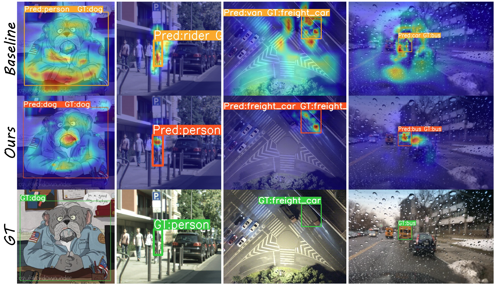
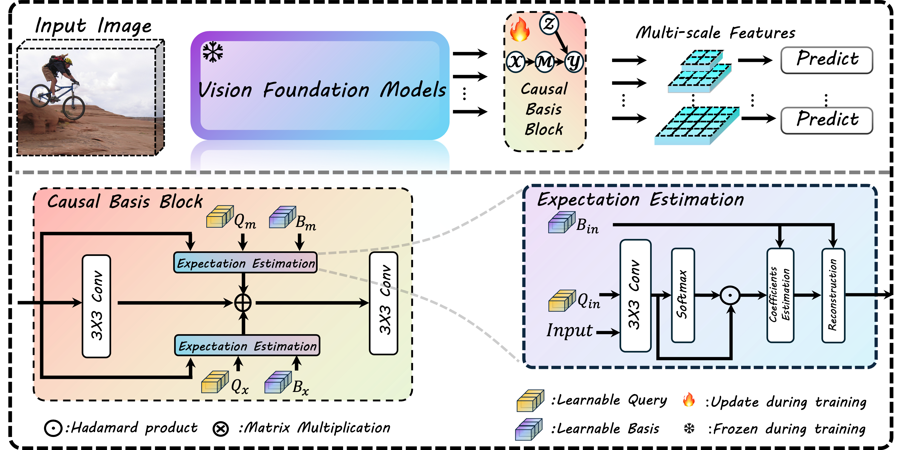

# Bridge: Basis-Driven Causal Inference Marries VFMs for Domain Generalization

<p align="center">
  <strong>CVPR 2026</strong> &nbsp;|&nbsp;
  <a href="https://arxiv.org/abs/2604.26820">arXiv</a> &nbsp;|&nbsp;
  <a href="https://arxiv.org/pdf/2604.26820">Paper</a>
</p>

## Abstract

Bridge is a basis-driven causal inference framework for domain-generalized
object detection with Vision Foundation Models (VFMs). It addresses the
performance drop caused by source-to-target distribution gaps, especially in
single-source settings where detectors may overfit to confounders such as
illumination, style, and object co-occurrence. Bridge learns low-rank bases for
front-door adjustment, suppressing spurious correlations while filtering
redundant or task-irrelevant components. The framework is designed as a
plug-and-play module for both discriminative VFMs, such as DINOv2/3 and SAM, and
generative VFMs, such as Stable Diffusion. Experiments across cross-camera,
adverse-weather, real-to-artistic, diverse-weather, and UAV-based benchmarks
show consistent gains over prior domain-generalization object detection methods.

## Teaser

<p align="center">
  
</p>

## Framework Overview

<p align="center">
  
</p>

## Bridge configs

This folder contains the MMDetection configs used for Bridge, a DINOv3-based
domain-generalized object detector. The configs are organized by benchmark and
share the same high-level recipe:

- frozen DINOv3 ViT-L/16 backbone
- trainable Bridge/CIM feature blocks in the backbone and RoI head
- Faster R-CNN detection head with FPN
- RandAugment, RandomErasing, and Albumentations domain adaptation
- multi-domain evaluation metrics for domain generalization

## Code entry points

The Bridge configs rely on the following custom modules in this repository:

| Component | File | Purpose |
| --- | --- | --- |
| DINOv3 backbone | `mmdet/models/backbones/dinov3.py` | Wraps DINOv3 ViT-L/16 for detection and exposes multi-scale FPN features. |
| Bridge/CIM blocks | `mmdet/models/backbones/cim_utils.py` | Implements the basis projection and expectation-estimation blocks used by Bridge. |
| Bridge RoI head | `mmdet/models/roi_heads/standard_roi_head.py` | Registers `CIMStandardRoIHead`, which applies a Bridge block on RoI features. |
| Domain adaptation transform | `mmdet/datasets/transforms/albu_domain_adaption.py` | Applies HistogramMatching, FDA, or PixelDistributionAdaptation from Albumentations. |
| DG COCO metric | `mmdet/evaluation/metrics/dgcoco_metric.py` | Reports COCO metrics separately for each target domain. |
| DG VOC metric | `mmdet/evaluation/metrics/dg_metric.py` | Reports VOC mAP separately for each target domain and their mean. |
| VOC DG dataset | `mmdet/datasets/voc.py` | Registers `VOCDGDataset` with the 20 Pascal VOC classes. |

## Config layout

```text
configs/bridge/
  cityscapes/
    dataset/      # Cityscapes source-domain dataset configs
    eval/         # Cityscapes, BDD100K, and Foggy Cityscapes eval sets
    schedule/     # 20k-iteration schedules
    dinov3/       # DINOv3 baseline and Bridge variants
  dronevehicle/
    dataset/      # DroneVehicle day-source training configs
    eval/         # dark, extreme-dark, and foggy eval sets
    schedule/
    dinov3/
  voc_dg/
    dataset/      # VOC 2007+2012 source-domain training configs
    eval/         # Clipart, Comic, and Watercolor eval sets
    schedule/
    dinov3/
  weather/
    dataset/      # Diverse Weather daytime-clear source configs
    eval/         # night-sunny, dusk-rainy, night-rainy, daytime-foggy eval sets
    schedule/
    dinov3/
```

## Installation

Install this repository as an editable MMDetection package.

```bash
conda create -n bridge python=3.10 -y
conda activate bridge

pip install -U openmim
mim install "mmengine" "mmcv>=2.0.0"
pip install -r requirements.txt
pip install -v -e .
```

The configs expect the DINOv3 ViT-L/16 checkpoint at:

```text
pretrain/dinov3_vitl16_pretrain.pth
```

Please obtain the checkpoint from the official DINOv3 release channel and place
or symlink it to that path. The DINOv3 source files included in this repository
retain their upstream license notices.

## Data layout

All configs use paths relative to the repository root. A typical layout is:

```text
data/
  VOC/
    VOC2007/
    VOC2012/
    clipart/
    comic/
    watercolor/
  cityscapes_clear/
    cityscapes_train.json
    cityscapes_val.json
    leftImg8bit/
  BDD100K/
    bdd100k_val.json
    images/
  cityscapes_foggy/
    foggy_cityscapes.json
    leftImg8bit/
  diverseWeather/
    daytime_clear/
    night_sunny/
    dusk_rainy/
    night_rainy/
    daytime_foggy/
  DroneVehicle/
    day/
    dark/
    extreme_dark/
    foggy/
```

The COCO-style evaluation configs reference annotation files such as
`data/night_sunny.json`, `data/cityscapes_clear/cityscapes_val.json`, and
`data/DroneVehicle/dark.json`. If your dataset conversion stores annotations in
another location, update the `ann_file` and `ann_files` fields in the relevant
`dataset/` or `eval/` config.

The `AlbuDomainAdaption` transform samples target images from `target_dir`.
For VOC, `target_dir` is a list of VOC-style roots. For Diverse Weather it is
the source-domain split text file. For Cityscapes and DroneVehicle it is an
image directory.

## Training

Use MMDetection's standard training entry point. Examples:

```bash
# VOC DG, Bridge
bash tools/dist_train.sh \
  configs/bridge/voc_dg/dinov3/faster-rcnn-dinov3-fd-0.125-voc.py \
  4

# Cityscapes -> BDD100K/Foggy Cityscapes, Bridge
bash tools/dist_train.sh \
  configs/bridge/cityscapes/dinov3/faster-rcnn-dinov3-fd-0.7-k3-cityscape.py \
  4

# Diverse Weather, Bridge
bash tools/dist_train.sh \
  configs/bridge/weather/dinov3/faster-rcnn-dinov3-fd-0.5-k3-weather.py \
  4

# DroneVehicle, Bridge
bash tools/dist_train.sh \
  configs/bridge/dronevehicle/dinov3/faster-rcnn-dinov3-fd-0.5-k3-dv.py \
  4
```

Most configs train for 20k iterations and use `auto_scale_lr` with a base batch
size of 4. Adjust `train_dataloader.batch_size`, `num_workers`, and the number
of GPUs to match your hardware.

## Evaluation

Use the same config and a trained checkpoint:

```bash
bash tools/dist_test.sh \
  configs/bridge/voc_dg/dinov3/faster-rcnn-dinov3-fd-0.125-voc.py \
  work_dirs/bridge_voc/latest.pth \
  4
```

`DGVOCMetric` and `DGCocoMetric` split results by matching each configured
`dataset_key` against `img_path`. Keep domain names such as `clipart`,
`watercolor`, `night_sunny`, `dark`, or `foggy` in your image paths, or update
`dataset_keys` accordingly.

## Config naming

The DINOv3 config names encode the main ablation:

- `baseline`: frozen DINOv3 Faster R-CNN without Bridge/CIM blocks.
- `fd-{ratio}`: enables Bridge/CIM blocks with `basis_reduction_mode="mul"` and
  a ratio such as `0.125`, `0.5`, `0.7`, or `0.9`.
- `k1` / `k3`: uses a 1x1 or 3x3 convolution kernel in Bridge/CIM blocks.
- `nohead`: disables the Bridge/CIM block in the RoI head.
- `noinputsubspace`, `nonorm`, `query`: VOC ablations for input subspace
  projection, basis normalization, and query estimation.

## Open-source checklist

Before publishing a release, check the following:

- Remove generated `__pycache__/` folders if they are present in the working
  tree. They are ignored by `.gitignore`, but should not be committed.
- Do not commit local data, pretrained checkpoints, work directories, or result
  visualizations. The current `.gitignore` already excludes `data/`,
  `pretrain/`, `work_dirs/`, `*.pth`, and common generated outputs.
- Verify that every public config uses relative paths under `data/` and
  `pretrain/`.
- If you include DINOv3-derived source files, keep the upstream license notices
  and document any checkpoint download requirements.
